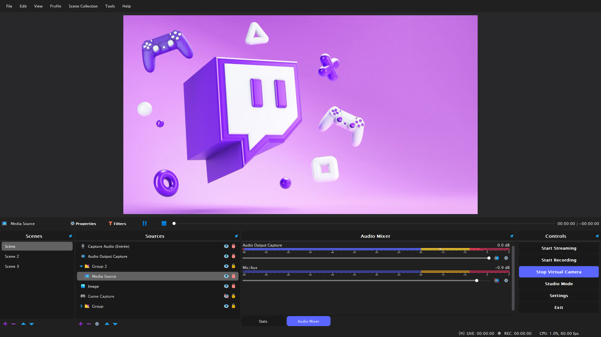

# DarkyBobby
### OBS Studio (27.2.4) theme 

## how to install

[download](https://github.com/weezyjs/DarkyBobby/archive/refs/heads/main.zip) the **DarkyBobby** theme

copy the **"DarkyBobby"** folder and the **"DarkyBobby.qss"** file to your "themes" directory

select the **"DarkyBobby"** theme in the OBS settings and voilà

*by default the installation path is located:* **C:\Program Files\obs-studio\data\obs-studio\themes**

